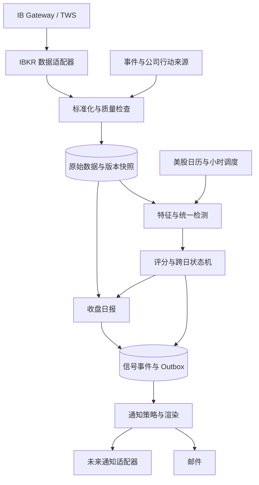

# AccuFlow：美股持续建仓迹象检测机制 v1

> 2026-09-17 更新：识别模型的后续设计以 [v2 设计](detection-mechanism-v2.md) 为准。本文保留为 v1 历史设计与实现依据；Web 与自动监测仍为 v1；v2 已有独立收盘研究原型，识别效果尚未验证。

设计日期：2026-09-12。状态：可供实现和验证的设计，尚未接入 IBKR、运行回测或启用邮件。文中的权重、阈值和质量门槛均为实验初值，不是已验证的交易规律。

## 1. 产品约定

- 监视用户指定的美股，主要寻找跨 3—10 个交易日持续出现的买方需求或承接迹象。
- 正常交易时段每小时检测一次；发生新的重要异动、显著增强或原信号失效时发送邮件。
- 每个交易日收盘后发送一封日报，包括无信号、数据不完整和运行失败的情况。
- 邮件为首个通知适配器。检测结果、通知策略、内容渲染和具体渠道解耦。
- 行情唯一通过 `ib_async` 连接 IBKR TWS API，由 IB Gateway 或启用 API 的 TWS 提供会话；不实现其他行情源或官方 `ibapi` 适配器。
- 输出是可复核的证据、竞争解释和状态变化，不能确认账户身份、实际净持仓、机构成本或未来收益。

核心假设：大型交易需求若被拆分执行，可能留下跨时段持续的方向偏好；被动执行可能表现为卖压较大但价格冲击较小。订单拆分与订单流持续性存在实证研究支持，但来自其他市场的结果不能直接视为本系统在美股的有效性证据。[订单拆分研究](https://arxiv.org/abs/2301.13505)

## 2. 检测频率与采集频率分开

交易日使用 America/New_York 时区和实际交易日历，内部时间使用 UTC。正常交易日按开盘后每 60 分钟形成一个检查点：10:30、11:30、12:30、13:30、14:30、15:30 ET。窗口为左闭右开；首小时覆盖 09:30—10:30。默认在检查点后 2 分钟完成补数和判断，告警同时注明数据截止时间与发出时间。

收盘 +20 分钟生成日报，覆盖最后不足一小时的数据。正常收盘 16:00 时日报目标为 16:20 ET；13:00 提前收盘时为 13:20 ET。提前收盘日只安排收盘前的小时检查点，不使用普通全天总量作为参照。无交易日不生成交易日报。

盘前盘后分区保存，首版不参与常规吸筹评分。开盘与收盘附近单独分层，并运行剔除首尾 15 分钟后的敏感性检查，不能将全部尾盘交易直接删掉。

统一检测流程每小时增量获取全部监视股票已结束的 1 分钟 TRADES bars，并在本地聚合成 5 分钟和小时窗口。交易时段同时在 IBKR 实际逐笔订阅额度内持续接收成交与 BidAsk；额度由确定性的优先队列分配，不形成不同产品档位。若只在整点读取一张快照，无法恢复此前一小时的承接和买卖压力过程。

截止时间到但数据尚未完整时，执行带截止时间的有限重试。最终输出“本次数据不足”，不使用未完成 K 线冒充完整窗口。历史补数不补发已经过时的交易提醒，仍保存重算结果供日报和审计使用。

## 3. IBKR 数据能力与限制

### 3.1 统一数据范围

系统只有一套检测流程和一套状态机。输入包括 1 分钟 OHLCV、WAP、成交笔数（实际返回时）、日线、大盘及行业参照，以及订阅额度内持续接收的逐笔成交、同步 BidAsk、成交属性和实际可用交易场所字段。

分钟量价数据支持持续放量、支撑反应、量价重心、相对强弱和缩量回调；合格的成交报价数据进一步支持估计成交方向、买卖压力持续性、条件价格冲击和承接事件。字段或覆盖不足只会降低对应证据的可用性并写入质量报告，不会切换成另一种档位或另一套分数。

无论字段多完整，系统都不能声称观察到主动买入的真实账户归属、实际订单拆分、完整市场订单簿、机构真实净买入或已确认冰山单。

市场深度作为后续可选证据，不是第一版强依赖。可见档位补量不能独立确认冰山委托，多交易场所与隐藏流动性会限制推断。

IBKR API 的大多数证券行情需要相应订阅；登录并拥有交易权限不等于具备完整 API 行情权限。[API 行情订阅](https://www.interactivebrokers.com/docs/general/market-data-subscriptions/introduction)

普通 watchlist 行情由定时快照形成，不应当作逐笔成交序列。[报价更新方式](https://www.interactivebrokers.com/docs/tws-api/doc/market-data-live/top-of-book-l-1/market-data-update-frequency)

### 3.2 订阅预算

逐笔额度受总行情线路限制。官方当前示例中，100 条行情线对应约 5 条逐笔订阅。成交和 BidAsk 是不同请求；容量预算保守按每只股票占两个逐笔请求，并通过真实会话测试实际计数。不能承诺 5 条额度覆盖 5 只股票的双流。[逐笔额度](https://ibkrcampus.com/docs/general/market-data-subscriptions/market-data-lines/specialized-market-data-lines)

按“用户指定优先顺序 → 已有信号 → 新候选”分配逐笔订阅名额，预留重连余量，持续持有至少一个完整交易日，避免频繁轮询截断证据。新增订阅股票只从实际开始采集后获得逐笔证据，不能追溯宣称之前已被逐笔验证。常态阶段积累同一股票的基线，不只记录已经异常的区间，以免选择偏差。

### 3.3 历史与实时口径

IBKR 官方说明历史数据会过滤部分交易类型，历史成交量及 VWAP 可能不同于实时数据；在不同时间重新请求也可能出现调整。[历史过滤说明](https://www.interactivebrokers.com/docs/tws-api/doc/market-data-historical/historical-data-limitations/historical-data-filtering)

因此 bars 评分使用同一来源、同一会话范围和同一过滤口径的当前与历史数据；实时逐笔另建特征基线。不能把实时累计量除以经过不同过滤的历史量后称为异常放量。无法统一时，该指标不可用。

接入时核实 shares / lots 设置，在适配层统一为股，记录原始单位和换算版本，不一律乘以 100。[成交量单位](https://www.interactivebrokers.com/docs/tws-api/doc/market-data-historical/historical-data-limitations/historical-volume-scaling)

历史 ticks 请求单次最多请求 1000 个数据点，不适合作为全名单每小时完整逐笔回补方案。[历史逐笔请求](https://www.interactivebrokers.com/docs/tws-api/doc/market-data-historical/historical-time-sales/requesting-time-and-sales-data)

统一请求队列按接口应用节流、缓存和指数退避；30 秒及以下 bars 的特殊限制单独处理，不能泛化成全部接口的额度。1 分钟数据也要采用低并发、增量请求和服务端错误反馈。[小周期请求限制](https://www.interactivebrokers.com/docs/tws-api/doc/market-data-historical/historical-data-limitations/pacing-violations-for-small-bars-30-secs-or-less)

## 4. 数据处理与证据质量

每条数据记录 conId、symbol、event_time、received_at、source、feed_type、session、raw_unit、adjustment_version、condition_flags 和 connection_session。Ticker 改名依靠稳定合约标识处理。

分钟 bars 保存原始版本与修订版本。逐笔没有可靠全市场成交 ID 时，不能用“时间＋价格＋数量”简单全局去重，否则会删除合法的相同成交。保留回调序列与连接来源，仅对已识别的回放重叠去重；无法确定的区间标记质量问题。

质量门槛实验初值：

- 预期活跃分钟的可用比例至少 95%，未解释的连续空缺不得超过 3 分钟；停牌、真实无成交与采集失败分别标注，不填造交易。
- 使用成交方向证据时，成交与 BidAsk 双流连接覆盖至少 95%，可分类成交金额占比至少 70%，样本数量和有效子窗口数量达到配置下限；否则只禁用相关分项。
- 基线：目标 60 个交易日，至少 20 个有效交易日才进行正式排名；不足时使用独立标记的同流动性组先验，最多观察级。
- 过期、延迟、冻结、断线分别记录。延迟行情可以产生注明时间的量价观察；未通过同步质量检查的报价不用于主动方向分类。
- 数据质量和事件资料完整度单独展示，不与吸筹强度揉成一个分数。缺少事件资料不等于没有事件。

某类字段失效时保留其余有效证据，但缺失分项不重新分配权重。数据覆盖变化单独形成质量事件，不能解释为资金变化或“资金撤退”。

## 5. 统一统计基础

### 5.1 基线与尺度

成交量按过去 60 个合格交易日相同美东时段比较；不足 60 但达到 20 时注明样本数。价格反应按过去波动率、价差和流动性归一化。基线最多使用到前一交易日，排除当前检测区间。

可使用稳健标准化：z = (x - median(history)) / max(1.4826 × MAD(history), scale_floor)。scale_floor 根据该指标的单位设定。进入评分前将连续特征转换为历史分位数，极值截尾，避免一笔异常压倒全部证据。

量能指标：RVOL_slot = 当前完整窗口成交量 / 历史相同时段成交量中位数。当天累计量与历史相同已交易分钟数比较。金额按可用的 WAP × volume 估算并标明口径；WAP 缺失时只能使用标记过的近似值。

相对强弱：以前 60 个完整交易日拟合股票对大盘和行业参照的稳健回归，系数于开盘前冻结；计算当前区间收益减去模型预期收益的残差。行业资料缺失时降级为大盘参照。大盘与行业共线时做正则化或使用行业去市场残差，避免重复扣除。

### 5.2 三层时间结构

1. 5 分钟片段：形成局部买压、卖压、承接、冲高回落证据。
2. 每小时：聚合不重叠片段，要求异常分布在多个时间位置。
3. 跨日：判断最近 5 个交易日中是否至少 3 天重复，其中至少 2 天已完整收盘。

同一日无论出现多少小时信号，跨日统计只计一天。当前日是 provisional 证据，收盘后再固化。今日每小时更新为替换当前日记录，不重复累加昨日和今日的相同证据。

## 6. 主动持续买入证据

### 6.1 成交方向估计

对每笔合格成交，仅使用当时已经到达且时间不晚于成交的有效报价进行匹配；优先严格在前的报价。使用价格最小变动单位容差：接近 ask 的成交记 +1，接近 bid 记 -1；价差内成交采用 midpoint 比较或 tick rule 形成低置信度版本。中点、不一致报价、过期报价、交叉/锁定报价及特殊成交条件无法解释时记 unknown。

IBKR 成交回调提供时间、价格、数量、交易场所与特殊条件等字段，但不提供本机制所需的“真实主动方向标签”；该方向始终是估计值。[逐笔返回字段](https://www.interactivebrokers.com/docs/tws-api/doc/market-data-live/tick-by-tick-data/receive-tick-by-tick-data)

同秒多笔的真实先后顺序不一定可恢复；接收顺序也不能视为跨流交易所顺序。严格匹配与宽松匹配分别计算；如果方向结论随匹配方案反转，取消该窗口方向证据。初始 quote-age 阈值按 1 秒设定，再用 0.5/1/2 秒敏感性检查，未证实时间精度时保守标为 unknown。

不把 unknown 强行平分或归为买入。保存 classified_coverage = 已分类成交金额 / 全部合格成交金额。

### 6.2 拆单持续性

在每个 5 分钟窗口计算 PI = (估计主动买入金额 - 估计主动卖出金额) / 全部合格成交金额。分母包含 unknown，以免低覆盖造成虚高。PI 不是机构净流入。

计算正向窗口占比、最长正向片段、跨小时重复数及正压力集中度。只在自身历史分位数异常时加分，不把市场本来就存在的订单流持续性当作异常。

辅助用有效片段数 N_eff = (sum x)^2 / sum(x^2)，其中 x = max(PI,0) × 合格成交金额；正压力为零时 N_eff=0。高 N_eff 表示压力分散于多个片段，但仍需要方向强度和历史异常同时成立。

初始候选：本小时至少 8 个有效 5 分钟片段，其中至少 7 个为正向；小时 PI 高于自身同类历史第 80 分位；剔除贡献最大的一个片段后仍保留正向异常。所有条件待验证。

单笔规模、相似订单大小和时间间隔规律只作辅助解释，不独立触发。时间结构只能称为“与拆分执行相符”，不能把多个人的相似交易合并成已确认母单。

### 6.3 价格响应与反证

正向压力之后，观察已完成的后续 15—30 分钟中价格重心、成交加权均价和相对行业收益是否保持。未走完的后续区间标为 pending，等待下一检查点验证。

若持续主动买入但价格不涨、反复上影且不断跌回原区间，这是卖方供应强的竞争解释，扣减核心行为证据；不能反向把它当成买方隐藏吸筹证据。

## 7. 被动承接证据：隐藏需求的核心检测

### 7.1 寻找“卖压投入与价格结果不对称”

对估计主动卖出占优、成交量充足的 5 分钟片段，观察：同等卖压下，中间价下移是否显著小于历史常态，随后是否恢复。

定义卖压强度 u = 估计主动卖出金额 / 历史该时段正常成交金额。定义下行冲击 y = max(0, -片段内残差收益) / 历史相同时段残差波动率。用历史 sell-dominant 片段，按卖压强度、时段、波动率、价差及可用深度匹配，得到 E[y | 条件]。承接异常为预期下行冲击显著大于实际下行冲击。

第一版采用稳健分箱/近邻中位数，避免小样本复杂模型。有效历史匹配样本至少 30 个；不足则该特征不可用。不使用“卖出额 / 极小跌幅”产生无限大信号。

承接事件需同时具备：卖压处于自身历史较高分位、下行冲击较低、后续已结束的 15 分钟未继续走弱或恢复至事件前中间价附近。暂未恢复的事件只记候选。所有阈值按历史分位数设置并验证。

### 7.2 支撑区反复承接

每天开盘前固定过去 5 个完整交易日的参考价格区：历史低点附近、已知整理区下沿、前期成交密集区。分钟数据生成的成交密集区必须标注为近似量价区域，不能称为真实筹码或机构成本。

检测不同时间发生的独立回踩：同一轮连续下跌只能算一次；离开该区后再返回才能形成新事件。参考区宽度按前一日 ATR 比例设置。运行中出现的新区只能向前使用并保存建立时间，不能事后重画支撑再宣称此前成功。

多次卖压事件在同一区域被承接、后续低点稳定或抬高，支持被动承接解释。只发生横盘、成交不足或市场整体反弹不能独立支持。

### 7.3 盘口补量仅作为增强证据

若后续接入合格 L2，可检验买价区域成交后可见流动性是否持续恢复；保存交易场所与档位范围。报价增加不等于成交，撤单量也不等于卖出。无法重建完整订单链时只称“可见买方流动性恢复”，不称“发现冰山订单”。

### 7.4 被动承接的反证

卖压仍高、价格不断创造新低且不能恢复；参考区被放量击穿；此前承接价附近转为强卖方供应；或者全部承接只出现在一个短时段。这些降低被动承接证据。

支持区被击穿只代表原假设失效，不足以确认大户已经出货。

## 8. 量价结构证据

没有可用成交报价时，统一检测仍可使用分钟量价证据每小时运行，但必须明确标注成交方向证据不可用。使用以下族群，每族内归并相关指标：

| 族群 | 内容 | 权重 |
|---|---|---:|
| 量能分布 | 相同时段 RVOL、异常在多个片段分布、去除最大片段后的稳定性 | 20 |
| 承接形态 | 事先定义支撑区的回踩恢复、较高成交量下较小下行、缩量回调 | 30 |
| 跨日重复 | 最近 5 日相同结构的重复和连续性 | 25 |
| 相对强弱 | 大盘/行业调整后的抗跌与价格重心 | 15 |
| 成交重心 | 可用 WAP 计算的 VWAP 演变、维持于均价上方的时间 | 10 |

红 K 线成交量不是主动买入量。OBV、A/D、CMF 等若用于辅助图表，只归入量价族，不作为独立多项证据叠加。仅凭量价形成的承接形态属于较弱代理，不能继承逐笔订单流才能支持的结论。

## 9. 竞争解释与事件过滤

每个候选都同时评价持续买入、持续承接、强卖方供应、市场共同上涨和事件驱动等解释。

| 情况 | 系统处理 |
|---|---|
| 财报、并购、增发等公开事件附近突然放量 | 保留异动提醒，但改为“事件附近异动”，不直接升级成较强建仓迹象 |
| 指数调仓、收盘撮合贡献过大 | 做剔除撮合/尾盘窗口的重算，不能仅凭集中放量升级 |
| 与行业同步走强 | 相对强弱证据减分；本身不否认买方交易，但削弱股票特异性 |
| 单日急涨、潜在回补或对冲 | 标注竞争解释；要求后续跨日持续证据，不能用高成交量证明开多 |
| 买入很强但价格涨不动 | 倾向强供应反证，主动模型扣分 |
| 卖出很强但价格跌不动 | 仅在方向质量与后续恢复成立时支持被动承接 |
| 低流动性、宽价差、停牌恢复 | 独立分层或禁用方向模型，不套用大盘股参数 |
| 拆股、分红、代码变化 | 校验复权、价格与成交量单位后再计算 |
| 新闻/事件数据未接入或过期 | 显示“事件背景未完整核验”，限制升级，不写“无利好消息” |

IBKR 新闻与企业事件可用性须按实际 API 与订阅探测；不能默认账户包含财报日历和全部新闻。EventDataProvider 接口允许以后接入其他来源，首版可导入人工维护的事件表，并记录 known_at。

## 10. 评分、证据门槛与状态机

### 10.1 统一评分

系统只生成一个规则分数。主动买入、被动承接和分钟量价是同一证据图中的不同可观测结构，不产生独立档位分数。各族先归一为 0—1：

| 族群 | 可用证据 | 权重 |
|---|---|---:|
| 核心行为 | 方向偏好与分散执行；卖压—冲击不对称与恢复；量价承接代理 | 30 |
| 跨日持续 | 最近 5 日中已成立结构的重复和连续性 | 25 |
| 价格响应 | 买压后保持、重心上移、支撑有效、跌后恢复 | 20 |
| 相对强弱 | 股票特异性需求或抗跌 | 15 |
| 区间与分布 | 多时段分布、预先冻结的支撑区和成交重心 | 10 |

Score = clip(sum(weight × family_evidence) - contradiction_penalty, 0, 100)。同一族多个高度相关指标取稳健聚合，族群有权重上限。反证扣分最多 30 分；重大数据缺陷直接禁用相关证据族，不能用扣几分抵消。

连续指标的初始映射为 evidence = clip((percentile - 0.50) / 0.40, 0, 1)，较小更有利的指标先反向。族内预先列明的分项等权平均并要求核心分项有效；缺失分项贡献为零，同时降低覆盖说明，不重新分配其权重。分项、方向、基线、最少样本数和族内权重均随规则版本冻结。布尔结构证据用 0/1；核心行为必须成立，不能靠纯分位数分数触发。

反证实验映射：已完成响应区间显示方向与预期相反扣 15；去除最大贡献片段后异常消失扣 10；异常几乎全由首尾 15 分钟贡献扣 10；合计封顶 30。重大事件、基线缺失、结构失效另走标签或状态规则，不仅是扣分。之后通过验证集调节，保持每项扣分可解释。

跨日族：最近 4 个完整交易日加当前日的不同日期记录中，基础结构成立的日期按由新到旧 1、0.85、0.72、0.61、0.52 的固定权重合成，除以全部固定权重之和；基础结构只由核心行为及价格响应决定，不依赖最终分数，避免循环定义。当前日未满足至少两个独立小时前不贡献支持票。缺失日标 unknown，不贡献分数且不解释为无买入；至少有 4 个可评估日期才允许升级。日内权重不随检测次数增加。

缺少逐笔或报价字段不得把剩余权重归一到 100。核心行为族可由主动、被动或量价结构中通过门槛且证据最强的一种建立，其他结构作为支持或竞争解释，不能把高度相关的主动与被动分项直接相加。输出 `dominant_evidence` 描述本次主要依据，但只保留一个总分、一个 episode 和一套状态。从多个结构择优产生的选择效应必须在整个检测器的回测中评估。

### 10.2 独立证据门槛

升级必须具有核心行为证据、价格响应证据和跨日持续证据。相对强弱/VWAP/OBV 等趋势指标再多，也不能替代核心行为。只有当本次和上次评分使用相同规则版本且关键证据覆盖没有实质下降时，才把分数变化解释为信号增强或衰减。

“较强迹象”同时要求：最近 5 个交易日中至少 3 日支持，其中至少 2 日已经完整收盘；当前日覆盖至少 2 个独立小时，或收盘时有足够分散片段；事件背景已检查；数据质量通过。三次小时检测不等于连续三天。

### 10.3 实验状态规则

| 状态/事件 | 初始规则 | 通知 |
|---|---|---|
| 正常 | 无有效候选 | 仅日报 |
| 观察 | 分数 ≥55 且核心行为初现 | 仅日报，提高逐笔订阅优先级 |
| 新异动 | 首次 ≥65，满足至少两个证据族和当前窗口质量 | 发邮件；不足跨日条件时注明“仅今日异常” |
| 持续迹象增强 | ≥78，满足全部跨日、核心及价格门槛 | 发升级邮件 |
| 显著增强 | 同规则和可比证据覆盖下，相对上次已发分数增加 ≥10，且新增独立证据 | 可发邮件，遵循去重 |
| 衰减 | 已报警状态连续两次合格小时评分 <55 | 记录；若原为持续迹象增强则发减弱提醒 |
| 结构失效 | 事先保存的支撑区被有效击穿且未恢复 | 下次小时检测发失效邮件 |
| 数据不足 | 所需模型或基线不可用 | 独立健康状态，不据此降低资金状态 |

结构失效初值：连续两个已结束 5 分钟收盘位于参考区下沿 -0.25×前日 ATR 以下，且下行成交量处于自身同类时段较高分位；阈值待验证。重大事件进入独立标签，不强制推断资金反转。

去重按 episode_id 管理：首次异动、升级、失效各至多一次；普通增强两小时冷却并每日最多两次，失效绕过普通冷却。跨日持续但未变化不重新发“首次”，进入日报。连续两个完整且合格交易日低于观察门槛后关闭 episode，后续可以开启新一轮。数据中断不关闭 episode。

## 11. 邮件与渠道扩展

检测引擎只生成结构化 SignalEvent：event_id、episode_id、conId、symbol、event_type、severity、as_of、available_at、score、previous_score、dominant_evidence、supporting_evidence、counter_evidence、evidence_coverage、quality、known_events、invalidation_reference、config_version 和 evidence_snapshot_id。

NotificationPolicy 决定路由、合并、去重和冷却；NotificationChannel 接口为 send(envelope) -> DeliveryResult。首个实现 EmailChannel，SMTP 或邮件服务 API 的细节不进入检测器。未来增加 Telegram、企业微信、Push、Webhook，只实现适配器及对应渲染器。

事件与 outbox 在同一数据库事务落盘。幂等键包含事件、渠道和收件人，发送状态为 pending / sending / provider_accepted / failed / delivery_unknown。SMTP accepted 不等于进入收件箱。固定 Message-ID 降低重复风险，但普通 SMTP 无法保证严格恰好一次；超时后不能声称邮件未发出而无限重试。处理不确定投递并在日志/日报暴露，支持人工重试。

同一检查点多只股票触发时合并为一封，严重程度排序。只向配置的用户收件地址发送；首版不上自动交易接口。

邮件标题示例（虚构）：[AccuFlow][持续承接增强] XYZ｜3/5 日｜13:30 ET

正文：

- 判断：持续承接迹象增强；主要依据为被动承接；规则分 81，前次 69；不表示 81% 的机构建仓概率。
- 依据：卖压处于历史高分位；实际下行小于同等卖压常态；近期不同日期支撑有效；本次有新增已完成的恢复区间。
- 反证：当日行业同步走强，股票特异性证据较弱；本次使用已检查的事件日历与可用公告，标明查询时间和覆盖范围。
- 图表：最近 10 日量价及参考区、今日价格与 VWAP、小时证据及最近 5 日状态。
- 失效参考：预先冻结的支撑区域与触发规则，仅用于解释信号。
- 数据：截止时间、发送时间、来源、已分类成交覆盖、缺口、模式版本。

模板只能引用结构化字段。首版使用确定性模板；未来语言模型只能解释已经计算的结果，不能补造指标、新闻或决定交易方向。

## 12. 收盘日报

每个交易日固定一封，内容包括：监视股票数、成功评估数、无法评估名单、今日新增/增强/失效、全部自选股简表、信号跨日时间线、前几次提醒的后续表现、大盘/行业背景、已知事件、数据与邮件服务健康状况。

即使没有异动也发“今日未发现满足规则的新异动”。若数据失败，应写“今日无法完整评估”，不能写“无异动”。最后半小时的首次或失效事件纳入日报，默认不额外重复发同一检查点的邮件。

保存日报生成时的数据快照与报告版本；迟到修订保留新版本，常规不自动重发。只有修订改变重要结论时发送有明确原报告引用的更正通知。

## 13. 运行架构与存储

首版目标环境固定为 2 vCPU、2 GB RAM 的单机 Python 服务。行情适配层只使用 [`ib_async`](https://github.com/ib-api-reloaded/ib_async) 连接 IB Gateway/TWS，不安装官方 `ibapi`，代码使用 `connectAsync`、`reqHistoricalDataAsync` 和逐笔订阅接口，并继续遵守 IBKR 服务端限制。使用 SQLite 保存配置、状态、事件、任务和 outbox，逐笔及分钟数据按日分区存储为 Parquet。依赖版本在实现时核验并锁定。

`ib_async` 文档对批量数据场景建议给 Gateway 较大的 Java 内存；这高于本项目整机预算。因此 2C2G 版本禁止并发批量拉取全历史：历史补数按股票和日期分片、并发默认为 1，回调进入有界队列，检测逐只股票执行，图表与收盘压缩使用短生命周期任务。能否与 Gateway 同机稳定运行以整日压测为验收条件，不用库的批量示例推断容量。

主要模块：providers/ibkr_async、providers/events、ingestion、quality、features、detectors/unified、scoring、state、scheduler、reports、notifications、replay。`providers/ibkr_async` 是唯一行情入口；人工事件表不是第二行情源。

数据库实体：instruments、watchlists、source_capabilities、data_manifest、feature_snapshots、signal_episodes、signal_events、job_runs、notification_outbox、delivery_attempts、daily_reports、model_versions。

原始数据保留建议：逐笔 90 天可配置，聚合 bars/特征至少两年，信号证据快照长期保留。采集量和留存权限以实际行情许可为准。

调度持久化 job_key=(market_session, checkpoint, job_type)，使用租约防止两个实例重复运行。运行失败分股票隔离；重启补齐任务状态和数据，过期盘中信号只归档，日报若漏发则补发并注明实际发送时间。不同规则版本的重新计算不直接触发线上警报。

IB Gateway 需要重连与会话恢复处理，存在日/周重新认证流程，部分情况需要用户重新登录；守护进程不能代替这种认证。[重新认证说明](https://www.interactivebrokers.com/docs/tws-api/doc/tws-settings/daily-weekly-reauthentication)

认证失败、行情断线、数据落后、磁盘不足、邮件失败分别产生健康事件，正常恢复时合并一次恢复通知。邮件本身失败时只能在本地状态页与日志显示并等待恢复后汇总，不能假装邮件告警仍可靠。

## 14. 如何验证它发现的是有价值的持续需求

没有账户级真实标签，就不能用公开行情计算“主力建仓识别准确率”。分别验证结构识别是否可靠，以及这些结构是否具有额外的观察价值。

### 14.1 结构与数据正确性

人工审查保留图和原始数据的随机事件样本，包含正常、主动、被动、强供应、财报、调仓、坏数据。审查尽量不展示未来收益，避免上涨后倒推吸筹。比较不同成交方向匹配方法、剔除最大成交/撮合窗口后结论是否稳定。

必须覆盖的工程测试：shares/lots 换算、合法相同成交不被误删、跨流同秒歧义、时区/夏令时/提前收盘、缺失数据不转成卖出、同日多小时不变成多日、实时与历史口径隔离、窗口边界、重启幂等、SMTP 不确定投递、日报无异动/失败分支。

### 14.2 历史事件研究

先固定主观察目标：首次可送达告警后 10 个交易日的行业调整收益分布；5/20 日为辅助，不事后挑最好窗口。基准价格使用实际 available_at 之后首个可用价格，盘后报告使用下一正常交易时段的可执行参考价，不能用生成告警之前的收盘价模拟买入。

同时报告最大不利变化、最大有利变化、相对行业表现、结构失效率和每股票每月提醒数量。若模拟交易，另加价差、滑点和手续费；本工具本身只报警。

与相同提醒频率的简单放量上涨、普通相对强弱、匹配股票与市场状态的随机时间点比较。进行特征消融，检验逐笔成交、BidAsk 和承接分项是否在统一检测器中增加观察价值。

训练/调参/测试按时间前后分割，前推验证；相邻样本的最长 20 日标签重叠区做隔离。按日期和股票聚类估计置信区间，不把同一 episode 的多个提醒当独立样本。保留当时的自选名单/股票池和事件发布时间，纳入已退市或失败样本；历史不足则披露选择偏差，不宣称完整市场回测。

多股票、多特征和多个候选结构造成的多重选择，在完整通知政策下测量实际误报与提醒负担。第一版不输出未经校准的 p 值或概率；权重和阈值只在训练/验证区间调节，测试集冻结。

### 14.3 历史限制与前向验证

IBKR 事后历史数据可能经过修订，历史研究不能完全重现当时接收到的行情。因此第一天起保存接收时间与原始版本，进行至少 4—8 周前向观察；这只是初始稳定性检验，样本不足就继续积累，不能因运行满一个月就宣告有效。

对只有 bars 历史的阶段，只能验证量价相关分项；没有合格历史双流就不能声称已经验证成交方向和卖压—冲击分项。逐笔相关分项依靠 IBKR 持续采集形成基线并前向验证，不接入其他历史行情源补造验证结果。

若逐笔相关分项不能在样本外提高稳定性、相对收益或减少无用提醒，则保持研究状态，不因为叙述更像“主力行为”就提高通知等级。

## 15. 实施顺序与接入信息

1. 能力探测：通过 `ib_async` 确认 IB Gateway/TWS 连接、可用实时/历史订阅、双流容量、单位、覆盖、时间戳和历史长度；保存能力报告。
2. 基础闭环：分钟与逐笔采集接口、本地存储、统一每小时检测、事件表、邮件 outbox、日报、重启恢复与回放。
3. 证据完善：持续双流先做质量、方向敏感性和覆盖检查；基线成熟后才允许相关分项参与升级判断。
4. 验证上线：冻结候选规则，历史与前向对照评估，按证据质量逐步开放提醒。

实现前需要用户给出：首批股票及逐笔订阅优先顺序；使用 IB Gateway 还是 TWS；IBKR 行情订阅概况；2C2G VPS 的操作系统；发件服务和收件邮箱。敏感认证信息在本机配置，设计与接入探测不需要在聊天里提供账户密码。此设计不创建 Codex 自动化，也没有开始发送邮件；未来监视调度由项目服务承担。

验收要求：每个检查点都有可追踪结果；相同数据快照与规则版本可重放出相同信号；较强提醒具备核心、跨日、响应三类证据；缺失/延迟/修订不伪造资金变化；故障和无异动均进入日报；邮件失败可追踪；新增通知渠道无需修改检测模块。
