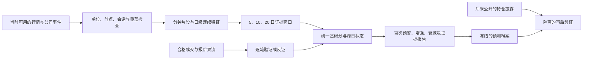

# AccuFlow 识别模型 v2：披露前的持续买方需求

设计日期：2026-09-17。设计标识：`accumulation-v2-design.1`。

状态：收盘研究原型已实现，参见 [v2 实现说明](v2-implementation.md)。2026-09-17 用户明确要求先实现模型、暂缓 13F 验证，因此本文持仓研究部分作为后续设计保留。Web 与自动监测仍运行 `unified-v1-m2.1`；v2 的机构识别效果和阈值尚未验证。

## 1. 产品目标与可验证的承诺

目标是在机构持仓披露之前，发现与持续建仓相符的交易行为，给出时间明确、证据可复核的预警。重点观察 3—20 个交易日的持续需求；单日异常可进入观察，但不能直接确认为机构建仓。

预测对象是证券上的持续买方需求，不是某个机构的账户身份。匿名行情无法独立确认伯克希尔正在买入，也不能区分所有长仓增加、空头回补与对冲交易。输出使用“持续买方需求迹象”，分数是规则强度，不是机构买入概率。

13F 仅进入事后验证库，不作为 v2 行情评分特征。已公开的公司事件用于解释当时交易与界定信息是否已公开。即使某家公司已因公开新闻上涨，模型也可以报告交易行为，但不把公开消息之后的信号计作提前发现该消息。

两项验收分开：工程能否稳定重放；模型在同等提醒数量下是否比简单量价指标更早、更集中地找到后来有重大增持披露的证券。工程通过不替代模型验收。

## 2. v1 的问题与明确替换项

GOOG 的 2025-09-15 至 2026-09-15 实测有 252 个可评分交易日、0 个首次信号、最高 25 分。两次支撑恢复与历史第 80 百分位放量没有同时成立。详见 [原始验收记录](validation/goog-backtest-20260916.md)。

| 当前实现 | v2 决策 |
|---|---|
| `features/extract.py` 要求同日两次支撑恢复与放量同时成立 | 支撑恢复变为一个局部特征；允许正常量能下的持续买入 |
| 核心行为不成立，价格响应也为零 | 价格保持、相对强度独立计算 |
| `state/episodes.py` 跨日只统计已经通过核心门槛的日子 | 跨日累积连续特征；不依赖昨日是否发过信号 |
| 支撑附近的承接路径主导可用分钟证据 | 同时解释温和累积、回调承接和趋势中持续买入 |
| 可选逐笔证据混入固定总分 | 分钟基础模型自身闭合到 100 分；逐笔提供单独的验证与反证 |
| 单只 GOOG 的结果被用于讨论 Alphabet 增持 | GOOG、GOOGL 分别计算，发行人层合并展示和去重，不混合原始成交量 |
| 收盘回测结果代替盘中效果 | 收盘实验和真实可用时间下的盘中实验分别验收 |

v2 不通过直接下调 v1 的 55/65/78 分门槛解决问题，也不以“必须命中伯克希尔案例”选择参数。

## 3. 模型结构

只有一个产品流程和一个 episode 状态。三种行为解释不各自生成一套报警，也不通过三个分数取最大值来增加试错机会。

- 温和累积：多日温和正向量价偏好、回撤时供给收缩、价格重心逐步提高；不要求爆量。
- 回调承接：下行成交活跃但冲击偏小，随后已经发生恢复，并跨日重复；不要求触及同一条五日低点。
- 趋势买入：相对市场的正向推进能保留，正向交易分布在多个时段，回调时破坏有限；不要求横盘或低价。

这些是待检验假设，不是已知机构交易的充分条件。

## 4. 输入、时间与数据范围

### 4.1 数据合同

| 数据 | 用途 | 首版要求 |
|---|---|---|
| 单证券 1 分钟 OHLCV、WAP | 分片量价与价格保持 | IBKR 同一 TRADES/RTH 口径；WAP 不可用时相关特征标缺失 |
| 拆股口径一致的日线与公司行动 | 回归、尺度、历史筛选 | 股数、价格、成交量分别审计；分红收益另行处理 |
| SPY 与事先确定的行业参照 | 剔除共同市场波动 | SPY 必需；行业缺失采用已标记的市场参照模式 |
| Last/AllLast 与 BidAsk | 估计方向、冲击与承接 | 可选；真实连续采集、同步与基线合格后才使用 |
| 当时已公开的事件与参考资料 | 竞争解释、信息公开截止点 | 保存来源、发布时间、首次获知时间和覆盖范围 |
| 13F 原件、修订及证券映射 | 事后弱标签 | 独立存储，不传入评分函数 |

保留 IBKR 为当前行情入口；本设计不要求购买新数据源，也不把 IBKR 历史 bars 称为全市场完整订单流。官方说明历史数据有交易类型过滤且可能修订，因此历史量与实时逐笔量不混用基线。[IBKR 历史过滤](https://www.interactivebrokers.com/docs/tws-api/doc/market-data-historical/historical-data-limitations/historical-data-filtering)

### 4.2 两种时钟与历史版本

每条输入保存 `event_time`、`received_at`、数据版本、来源与公司行动版本。在线判断只能使用事件已结束且在决策时已收到的数据。迟到与更正只能生成后续修订，不能把历史信号的首次可用时间提前。

历史重建若只有今天下载的数据，应记录 `data_vintage=historical_reconstruction`；此模式可做研究，不声称重现当年的实际数据到达时间。`online_archive` 的前向档案才可验收真实时延。已知事件也必须按当时公开时间截断。

回归、分位数与参考区在计算时只读取先前数据。多日窗口的比较样本结束日必须早于当前窗口起点，不能将正在判断的 20 日窗口包含进自己的背景分布。各历史样本自身也用其当时可用的系数与尺度生成。

### 4.3 基线、窗口和质量

- 5 分钟为局部统计单元；小时为更新频率；完整交易日为跨日计数单位。
- 多日窗口固定为 5、10、20 日，组合权重为 0.25、0.50、0.25；3 日只提供观察与早期持续性检查。不得事后挑选表现最好的窗口。
- 日级特征背景目标 126 个有效历史样本，最低 60 个；市场/行业回归目标 120 个完整日，最低 60 个。原始预热长度由完整依赖链计算，包含窗口与拟合所需历史，不能沿用现有 65 日常量。
- 分钟时段基线目标 60 日、最低 20 日。价格变化按同一时段的历史稳健波动率标准化，成交量按同一时段中位数标准化。
- 单日分钟覆盖率至少 95%、未解释连续缺口不超过 3 分钟。停牌、真实无成交、提前收盘和采集失败分别处理；当前与历史按相同已交易分钟数比较。
- 当前未收盘日单独保存 provisional 记录；每次更新替换，不重复累加。正式跨日持续性只计完整日；当日可以更新价格反证与观察提示。
- 缺失不等于零。无下跌事件在完整数据下属于已观察到“没有该类证据”；因数据缺失无法观察属于不可用，两者字段不同。

## 5. 基础证据：连续计算，独立解释

所有公式为首轮实验定义。具体样本构造、截尾范围、尺度下限和回归配置都必须进入冻结 manifest；不能实现时随意决定。

### 5.1 通用变换

5 分钟片段记价格 O/H/L/C、股数 V、WAP。零振幅片段 CLV 定义为 0；零成交或不完整片段不用于有成交特征。

`CLV = (2*C-H-L)/(H-L)`，范围 [-1,1]。它只描述收盘位置，不是主动买卖方向。

`v = V / median(先前同时间片成交量)`；将 v 截到 [0,3]，避免单个窗口主导。收益尺度使用 MAD，按最小价位对应收益设置正下限，避免极小波动使比值爆炸。

各原始指标按自身历史作有方向的中秩百分位 p。证据映射 `E(p)=clip((p-0.50)/0.45,0,1)`；不利方向单独映射为反证。当前指标等于常数历史背景则无异常证据；首次偏离常数背景可以用中秩百分位体现，不用 MAD 除以零。分位数排序方向、基线和样本数随结果保存。

### 5.2 四个证据族

| 证据族 | 权重 | 首轮原始特征 | 需要回答的问题 |
|---|---:|---|---|
| A 交易方向代理与分布 | 30 | 成交量加权 CLV；相邻 WAP 变化的有界有符号参与度；正向贡献的有效时段数与最大片段占比 | 交易是否反复偏向买方有利的一侧，而非一次撮合？ |
| B 下行冲击与恢复 | 25 | 活跃下行片段的条件冲击缺口；已完成后续窗口的恢复幅度 | 卖压代理出现时，价格是否比自身常态更抗跌？ |
| C 相对价格保持 | 20 | 市场/行业调整后的价格重心变化；已有推进的保留比例与回撤 | 需求迹象是否留下了可保留的价格结果？ |
| D 跨日连续性 | 25 | 未阈值化的日级 A/B 原始强度之连续水平、支持日占比、单日贡献集中度 | 弱证据是否在不同日期持续出现？ |

A 的三个分项等权；其中“参与度”使用 `sum(clip(v,0,3)*clip(相邻WAP对数收益/历史尺度,-1,1))/sum(clip(v,0,3))`。分布项必须同时有正向偏好才贡献，否则均匀但方向中性的成交不能加分。CLV、WAP 参与度、OBV/CMF 等同源代理不能被当作多个独立证据族。隔夜跳空不混入日内 WAP 变化。

B：用负残差收益且 v 达历史中位数以上的片段作为“下行成交事件”，不称真实主动卖压。按 v、时段、过去波动率匹配先前下行事件，至少 30 个匹配样本；取预期下行冲击中位数与实际冲击之差，再检查后续 30 分钟已经结束的价格恢复。恢复未结束为 pending，不能先加分再回填。条件冲击与恢复各占一半；只有低冲击或只有反弹不足以构成完整 B 证据。匹配只看当时已知条件，不能按未来是否恢复选择邻居。同一连续下跌不重复计数，重叠后续窗口合并为一个事件。

C：每日开盘前冻结稳健市场/行业回归系数。用日级 log(WAP) 变化减参照预期变化构造相对重心；同时记录窗口内已实现正残差推进的保留比例 `clip(当前累计残差/此前已出现的最大正累计残差,0,1)`，最大推进不足历史尺度时此项无正证据。两项各半；不能仅凭绝对股价上涨加满分。日线 close 与日内 WAP 分开，不拼接成同一种价格。

D：每日先生成连续原始强度 `u_d=max(A_d,B_d)`，不读取是否发信号或旧状态。使用窗口内 u 的均值、支持日比例及贡献分散度各占三分之一；支持日为 u 相对自身历史达到第 60 百分位且有实际正证据的完整日。u 的历史分布也通过相同 max 运算生成，不能把两路径选择当作额外独立证据。N_eff 定义为 `(sum u)^2/sum(u^2)`，全零时为零。D 是同类行为的时间持续性，不宣称与 A/B 统计独立；必须做去掉 D 的消融检验。

每个证据族先在各窗口计算同配置的特征分位数，再按 5/10/20 日固定权重组合；族内分项按上述固定权重聚合。A/B 日级值供 D 使用，D 不反馈到 A/B，避免递归与重复累计。所有指标同日只贡献一个日级记录。

### 5.3 总分与反证

`S = clip(30*A + 25*B + 20*C + 25*D - penalty, 0, 100)`。

“明确失败”取后续已完成 30 分钟的负残差收益强度，“集中主导”取去掉最大片段/首尾时段后证据减少的比例；均使用自身同处理历史百分位映射。首轮反证只有两个预注册项：正向代理较强而后续价格明显失败；证据被单个片段或首尾撮合支配。各项连续强度乘 10 分，合计上限 20 分；同一失败不跨多个名字重复扣分。剔除最大片段、首尾 15 分钟后都用同样处理的历史背景重算，保留完整分数与敏感性结果。不是一出现尾盘量就禁用整天。

没有逐笔时 S 的理论范围仍是 0—100，不再因为缺少成交方向数据使全部核心路径停摆。A/B/C 各自可贡献，无需共同满足同一个支撑形态。

基础字段缺失时不重新分配权重。输出可识别范围 `[S_lower,S_upper]`：已知项固定，未知正证据的最小值为 0、最大值为相应剩余权重；未知反证按 0—剩余最大扣分计算两端，最后截到 [0,100]。区间不是统计置信区间。正式候选要求至少 75% 基础权重可计算、A/C/D 可用，且最保守下界仍达到门槛；否则为数据不足/观察。WAP、行业参照等覆盖模式分别报告样本和表现，不混成“完整验证”。

这些权重是可复核起点，不是有效性的依据。第一轮只允许校准报警阈值，不同时搜索大量特征、窗口和权重。

## 6. 逐笔证据：验证方向，不伪造缺失历史

沿用并审计现有 `features/orderflow.py` 的报价时序、同秒歧义、unknown 分母和匹配敏感性检查。连接覆盖至少 95%、可分类金额至少 70%；报价匹配 0.5/1/2 秒敏感性不稳定时方向不可用。基线不足或只做过短时能力探测均不能声称已覆盖机构执行过程。

逐笔输出为 `supports / contradicts / inconclusive / unavailable`，分别记录主动买压持续、真实方向估计下的冲击不对称及反证。首版不把它加到基础分，防止订阅开关使分数突然跳变。合格支持可注明“逐笔佐证”；合格反证阻止“证据增强”升级并展示分歧，但不篡改分钟基础分。

逐笔单独发现而基础分未触发的情况进入研究日志，首版不另发一套报警。若后续证明有额外价值，必须单独版本化验证，不能临时接入。

持续采集需要独立完成；按实际订阅能力固定一组证券，包含未出现信号的对照股票，避免只给候选采集造成选择偏差。IBKR 的逐笔类型、额度与回补限制按真实会话核验。[IBKR 逐笔请求](https://www.interactivebrokers.com/docs/tws-api/doc/market-data-live/tick-by-tick-data/request-tick-by-tick-data)

## 7. 竞争解释与事件处理

财报、公开并购、股票发行、指数调整、公司回购和可能的空头回补都可能形成相似交易。保存证据与竞争解释，不简单宣布某一种为真实原因。股价上涨不能倒推出机构持仓增加。

已知重大公开事件附近的信号加 `event_associated`，保留原始分数，单独验收；不计为对该已公开事件的提前发现。事件背景未知时可以发带明确说明的量价候选，但不能使用“已排除事件影响”或升级为“背景已核验的增强”。这避免没有新闻接口就永久失去全部预警能力。

私募发行、股份转换、合并换股等无需在常规市场表现为持续买入的股数变化，验证库分类为 `non_open_market` 或 `mixed/unknown`。不能要求量价模型对已证实的全部非公开市场增持实现召回；也不能为了美化结果随意把没命中的案例归入此类。分类必须有独立文件证据，并且尽可能在查看模型输出前完成。

## 8. 候选、状态与通知

### 8.1 门槛校准

研究起点使用上节固定特征、权重和窗口。只在验证集从 `{50,55,60,65,70,75,80}` 选择一个首次候选阈值 tau：在验证集提醒负担平均不超过每 100 个合格发行人每周 2 个新 episode 的条件下，最大化按发行人季度去重的弱标签 F1；并列取更高阈值。如果没有配置满足约束，实验失败，不能从测试集选阈值。

提醒负担是研究初始预算，不是强制凑满的配额，也不在生产时用未来一周排名删除信号。观察阈值为 tau-10，增强阈值 tau+10（上限 95）。60/80 等分数不对应 60%/80% 买入概率。

### 8.2 状态迁移

| 状态 | 条件 | 用户含义 |
|---|---|---|
| normal | 当前无足够证据 | 尚未发现达到门槛的持续需求，不是确认无机构买入 |
| observing | 达观察阈值，或持续性尚不足 | 早期迹象；先记录，不反复推送 |
| candidate | S_lower >= tau，A/B/C 中至少两族 > 0.25，完整日支持数达到 3/5 或 6/10 | 首次持续买方需求预警 |
| strengthened | S_lower >= 增强阈值，至少新增 2 个独立支持日，事件背景已核验且无未解释重大事件、无合格逐笔反证 | 新证据使原判断增强，不称机构身份已确认 |
| waning | 同覆盖口径下连续 3 个有效收盘低于观察阈值 | 持续性减弱，不能直接叫机构撤退 |
| invalidated | 原假设的价格保持失败与反向需求证据同时成立，并在连续 2 个有效收盘确认 | 原行为假设失效，不是确认某机构清仓 |

“价格保持失败”首轮定义为相对累计推进已回吐、且收盘低于 episode 创建时冻结的近 20 日价格中位数减 1 个当时 ATR；“反向需求”指同一方向代理的负向历史百分位 >= 80。两者分开保存，不能用事后移动参考线。此参考用于解释失效，不用于猜测机构成本。

关闭规则：invalidated 当日关闭；waning 后累计 5 个连续有效低分收盘关闭。中间回升重置低分计数。下一 episode 至少在关闭后 5 个交易日、出现新的支持日才开始。缺失数据不增加低分天数，不自动结束 episode；连续缺失 5 个交易日仅标 stale。

小时检查点只更新当日证据，不能把多个小时当成多天。新 candidate 每个 episode 只提醒一次；增强每个完整日最多一次并需新增证据。GOOG/GOOGL 各自形成证券信号，发行人层在同一检查点合并提醒，验证时不把同一发行人事件当两个独立成功案例。

## 9. 事后验证：13F 是季度弱标签

### 9.1 标签对象和边界

标签先按 `security_class × quarter` 构造；主指标再按 `issuer × quarter` 合并。GOOG/GOOGL 仍须各自用本类别行情匹配本类别的增持标签，不能拿 GOOG 的信号直接算命中 GOOGL 的买入。一个发行人季度最多计一个成功、一个首次提醒；分证券明细另报。选定机构的 13F 长仓股数经公司行动统一后，衡量季度净增加；不是按持仓市值变化判断增持。

主标签：预先冻结的机构样本中，至少一个独立管理集团在该证券季度内出现重大普通股净增加。机构名单只依据实验开始前可用资料选择，清单及理由入档；不能仅挑已知成功案例。新加入或退出机构按事先规则处理，避免只保留存续机构。

首先从拆股调整后的持股变化中，扣除有完成凭证与准确股数的私募获配、转换及转入等非市场交易变化，保留原始变化与调整明细；混合来源无法可靠拆分则标 unknown，不把整笔算作公开市场买入。下述净增股数指完成这种审计后可归入市场交易研究的净变化，仍不是逐笔买入记录。

首轮重大增加定义：上述净增股数乘上季末同口径收盘价 >= 1 亿美元，且为新建仓或较上季股数增加 >= 20%。这只是实验标签定义；不是市场中的天然分界，也不能为了 GOOG 调整。上季持仓缺失不能自动当零；必须核实为完整申报中的未持有，否则标签未知。低于规模的增持另列，不冒充负面真值。

辅助标签单独记录：增持管理集团数量、样本机构合计净增股数、占已知流通股的比例（资料缺失为 null）。一个机构买、另一个机构卖仍可满足主标签；合计净增为负也不能抹掉这个事实。合计只代表该样本，不称全市场“机构净流入”。

普通股与期权分开；共同投资权限、母子管理人和重复申报先去重。同一管理集团的多个账户先合计，不能当多家机构。保留 CIK、CUSIP/类别、季度、accession、accepted_at、原始股数、修订关系、公司行动依据及标签版本。

13F 不披露空头头寸，也不提供季度内执行日期；有保密与修订情形。因此“无重大增加披露”只能作为对照标签，不能认定当时没有买入。SEC 资料支持这些披露边界，不能据此把季度持仓变化变成逐日交易真值。[SEC 13F FAQ](https://www.sec.gov/rules-regulations/staff-guidance/division-investment-management-frequently-asked-questions/frequently-asked-questions-about-form-13f)

### 9.2 提前量不能借用披露延迟

主指标只匹配增持季度内部产生的首个 candidate，并要求早于该次相关增持首次公开信息；旧季度已知持仓不算本次新增持仓的公开时间。第一份相关 13F、13D/13G 或明确公司公告中最早的公开时间作为截止点。记录所有候选，不能回头挑最接近低点的一天。

- `lead_to_publication`：首次相关信息公开时间减信号首次可用时间，报告自然日与交易日。
- `lead_to_quarter_end`：季度末减信号首次可用时间，只用来说明是否在持仓形成季度内预警；不是领先真实买入的天数。
- 季末之后、13F 之前才出现的信号，单列为“披露前但季度后”，不计入主召回。
- 原 episode 跨季度不每季重复计一次成功；首季计主匹配，后续季度只记持续状态。另报每季状态覆盖，不能混入新预警召回。
- 季度内买后卖掉可能不形成期末增持；不能用该标签计算真实逐日买入准确率。

最新季度尚未披露、申报不全或持仓变化来源不明，一律 `unknown`，不提前判负。标签可在之后修订，但必须保留实验当时的版本与重评差异。

## 10. 实验与成功标准

### 10.1 样本与时间切分

GOOG/GOOGL 的已知增持案例用于开发诊断，不能再充当未见测试。先建立多个行业、多种流动性、增持与对照季度的样本库；证券池在每期开始时按当时可用清单和前 60 日成交额筛选，不用今天的指数成分回填历史。研究起点为美股普通股、前 60 日中位日成交额 >= 2000 万美元、股价 >= 5 美元；其他证券另行验证。

目标是至少 8 个样本外季度、50 个独立发行人、100 个合格正例发行人季度。少于此规模允许形成阶段结果，状态只能是“证据不足”，不能宣布模型通过。缺少历史成分、退市行情或修订档案时披露受限范围，不能声称全市场有效。

时间滚动顺序：24 个月训练/背景分析，6 个月验证，接下来的 3 个月测试；每次向前滚动一季度，直到覆盖所需测试季度。训练/验证的标签必须在该次冻结时已公开；最近未成熟的季度剔除，即使交易日期属于训练区间。重叠的测试区间不能重复计样本。

按季度/episode 分组切分；移除标签结算或未来收益评估跨过冻结边界的训练样本，并设置 20 个交易日隔离区。特征历史可以向前读取此前可用行情，但不得从未来重新拟合。置信区间按发行人与季度做两维聚类重采样，不把重叠 20 日窗口视为独立实验。

### 10.2 必须比较的基线

相同证券池、相同可用日期和同等提醒数量下，比较 v1、单纯 RVOL、市场调整后 20 日动量、量价 OBV/CMF 组合与固定种子的随机提醒。每个基线只在验证集校准门槛；v1 原版零提醒如实保留，并说明无法按相同预算比较该配置。

消融包括：去掉跨日 D、去掉条件冲击 B、只用价格动量、去掉行业控制、去掉事件分层。逐笔增加的价值仅在双方都有合格数据的共同样本比较；不拿有逐笔的少数精选股票与全市场混比。

### 10.3 指标与放行条件

| 指标 | 计算与用途 |
|---|---|
| 季度正例召回 | 合格重大增持发行人季度中，有同类别匹配的季度内首次预警的比例；不是买入日期召回 |
| 披露支持率 | 已有成熟标签的预警发行人季度中，后来披露同类别主标签的比例；不是实际机构买入准确率 |
| 对照提醒率 | 没有主标签的合格发行人季度被提醒的比例；不称真实误报率 |
| 提醒负担 | 每 100 个合格发行人周的新 episode 数；去除重复加强推送 |
| 提前量 | 同时报到公开信息、到季度末的中位数及分位数 |
| 价格用途 | 首次可用信号后下一交易日开盘起 5/10/20 日收益、市场超额、MFE/MAE；含费用假设与不含费用两表 |
| 可用率 | 全部计划检查点中可评分/覆盖不足/延迟的比例，防止只挑数据齐的日子 |

股票池有 unknown 标签时，同时报所有提醒数量、成熟标签覆盖率和把 unknown 全算不支持/全算支持的范围，不通过删掉未知样本美化支持率。持续状态、首次提醒、证券类别明细和发行人季度统计分别展示分母。

首轮模型效果放行要求：在同等提醒预算下，相比验证集选定的最强简单基线，样本外披露支持率提升倍数点估计 >= 1.25，95% 聚类区间下界 > 1，且季度内召回不下降；分行业、市场阶段结果完整披露，不能靠一个发行人获得结论。该门槛是本项目预设验收目标，不是已有性能。如果区间无法估计、分母为零或样本不足，结果为不确定。

价格表现另行验收：支持率改善不能自动证明可交易收益；未通过成本与风险检查，不作盈利承诺。随后至少 60 个交易日冻结参数前向记录，检查时点与实际提醒负担；持仓效果还必须等对应季度披露成熟，不能以 60 天服务正常替代效果验收。

零信号不是成功；大量信号也不是成功。只有相对简单基线的增益与可接受的提醒负担共同成立，才支持产品价值。

## 11. 工程接口与迁移边界

以下为模块边界；本轮已实现收盘检测与状态模块，持仓标签与多标的评估模块仍为后续计划：

- `features/accumulation_v2.py`：局部连续特征、日级摘要、多日证据和反证；无数据库、新闻抓取或持仓查询。
- `detectors/accumulation_v2.py`：纯函数 `evaluate_v2(snapshot, manifest)`，返回证据、分数范围、状态、事件。
- `state/accumulation_v2.py`：新状态机，与旧 episode 隔离；旧状态不能直接迁移为 v2 的历史证据。
- `research/holdings_labels.py`：原始申报、证券映射、公司行动、弱标签与公开时间；只供研究 join。
- `research/evaluation.py`：滚动切分、基线、同预算比较、提前量及聚类区间。
- 现有 `services/backtest.py` 保留 v1 入口；新增版本显式选择与跨证券季度研究入口，不能静默改变 `backtest` 的旧结果。

结果合同至少包含：`model_version / manifest_hash / feature_schema / instrument_key / issuer_key / as_of / available_at / data_vintage / score_lower / score_upper / threshold / families / coverage / flow_verdict / event_context / state / episode_id / evidence_ids / pending / counter_evidence / baseline_ranges / state_before / state_after`。

快照记录模型代码哈希、参数、系数、所用历史分布或其可定位输入、输入数据版本及当时可知事件。13F 标签另存实验结果，以 `prediction_id` 关联，不写回原始预测。旧分数与 v2 分数不能画成同一连续序列而不注明版本。

保留只读 IBKR、SQLite、不可变快照与既有投递 outbox。研究结果不写业务状态、不产生邮件。2C2G 在线端顺序处理证券，增量存日级摘要，不在每个检查点重扫全部多年分钟数据；多年实验离线分批运行。原始数据按分区引用及校验和去重，仍须可完整重放，避免像现有回测一样为每个检查点重复存整段历史。

## 12. 实施顺序与每步退出条件

| 步骤 | 交付物 | 退出条件 |
|---|---|---|
| V2-1 数据与验证合同 | 证券/发行人映射、事件时钟、13F 标签规范、样本 manifest | 能分开 GOOG/GOOGL、发行增股与普通增持、unknown 与对照；标签来源可审计 |
| V2-2 基础检测原型 | 连续四族、多日聚合、状态机、版本化回放 | 无前视；温和买入不依赖同日爆量；完整零证据与缺失可区分；所有输出可重放 |
| V2-3 历史实验 | 多标的滚动验证、简单基线与消融、冻结门槛 | 输出全部指标与失败案例；GOOG 只作诊断；样本不足明确不通过 |
| V2-4 逐笔与前向影子记录 | 持续双流、订阅覆盖档案、至少 60 日冻结预测 | 明确逐笔额外价值；质量变化不误报衰减；等待持仓标签成熟 |
| V2-5 接入产品 | v2 报告、发行人去重、解释与投递 | 研究放行与前向验收通过，保留 v1 历史回放；届时才替换默认模型 |

首个原型先验证收盘模型；盘中 provisional 特征必须使用同检查点历史背景另行校准与回测，不能直接拿全天阈值处理半天数据。盘中验收完成前，小时更新只提供观察与反证，不声称已经验证盘中首次预警效果。

原型测试覆盖：追加未来行情不改变过去输出；后公开事件不改变旧预警；13F 文件变化不影响检测分数；同日重跑不增加持续天数；暖启动与完整历史计算一致；缺失逐笔不改变基础分；单日爆量不能伪造跨日；长期温和代理可累积；上涨后派发/市场同步上涨对照；非交易日/提前收盘/公司行动；多类别不重复计成功；episode 跨季不重复召回；数据覆盖变化不触发资金撤退。

实验登记至少固定：样本名单与当时来源、机构集团映射、日期切分、标签与事件版本、字段及缺失策略、所有公式/分位数/权重/窗口、tau 搜索集合、提醒预算、费用情景、随机种子、聚类重采样方法、排除规则、代码与数据哈希。登记后再开测试集；改变任一研究选择均须新实验编号。

## 13. 研究依据与当前证据状态

订单拆分可能造成持续订单流，是建模动机；相关研究使用东京证券交易所的细粒度交易数据，不直接证明本项目的美股分钟代理有效。[Sato 与 Kanazawa，2023](https://arxiv.org/abs/2301.13505)

当前已有：v1 的真实 GOOG 分钟/日线与审计、可回放工程、失败案例。当前已补充 v2 收盘研究原型与隔离回测入口。当前缺少：GOOGL 同口径回测、多证券多季度持仓标签、当时可用的事件与股票池档案、合格持续双流、v2 样本外结果。设计解决的是识别目标与验证方法；这些数据与实测仍是下一阶段的实际工作。
